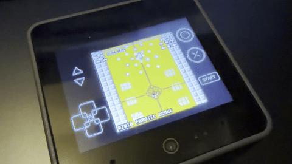

# RONTO8 for M5Stack CoreS3 (v0.53)



RONTO8 is an experimental [PICO-8](https://www.lexaloffle.com/pico-8.php) compatible fantasy console emulator specially designed and optimized for the [**M5Stack CoreS3**](https://docs.m5stack.com/ja/core/CoreS3). It is based on [femto8](https://github.com/benbaker76/femto8) and [zepto8](https://github.com/samhocevar/zepto8), bringing the joy of portable PICO-8 gaming and coding to this powerful device.

RONTO8は、[**M5Stack CoreS3**](https://docs.m5stack.com/ja/core/CoreS3) 専用に設計および最適化された [PICO-8](https://www.lexaloffle.com/pico-8.php) 互換のファンタジーコンソールエミュレータ（実験バージョン）です。[femto8](https://github.com/benbaker76/femto8) と [zepto8](https://github.com/samhocevar/zepto8) をベースにしており、このパワフルなデバイスでPICO-8のゲームやコーディングの楽しさを持ち歩くことができます。

---

## ⚠️ Disclaimer / 注意事項

- **Experimental Release / 実験的なリリース**: This is highly experimental code. If you find bugs, please report them gently! (実験的なコードであるため、バグを見つけた場合は優しく教えてください！)
- **Memory Limitations / メモリ制限**: Due to the hardware limitations, some very large PICO-8 cartridges may not work or may cause "not enough memory" errors during Lua compilation. (ハードウェア制限により、非常に大きいカートリッジは動作しないか、コンパイル時にメモリ不足エラーになる場合があります。)

---

## 🌟 Key Features / 主な機能

- **Optimized for M5Stack CoreS3**: Full support for the CoreS3's display and touch screen as a virtual gamepad.
  - CoreS3のディスプレイとタッチスクリーン（仮想ゲームパッド）に完全対応。
- **SD Card ROM Browser**: Load `.p8.png` or `.p8` cartridges directly from the SD card.
  - SDカードから `.p8.png` や `.p8` 形式のカートリッジを直接ロード可能。
- **Audio Support**: Enhanced audio synthesis for authentic PICO-8 SFX and Music playback.
  - PICO-8特有の効果音（SFX）やBGMを再現するオーディオエンジンを搭載。

## 🎮 Controls / 操作方法

- **Touch Screen / タッチスクリーン**: A virtual gamepad is displayed on the screen. (画面上に仮想コントローラーが表示されます)
  - **D-Pad / 方向キー**: Left side of the screen (画面左側)
  - **Button O**: Top right (画面右上). Hold for 1 second to lock the button state. (1秒長押しでボタンが押された状態にロックされます)
  - **Button X**: Bottom right (画面右下). Hold for 1 second to lock the button state. (1秒長押しでボタンが押された状態にロックされます)
  - **Start / Pause**: Bottom center (画面下部中央)
  - **Volume**: Left edge volume buttons (画面左端のボリュームボタン)

## ⚙️ Installation / インストール

### Via [M5Burner](https://docs.m5stack.com/en/uiflow/m5burner/intro) (Recommended)
You can easily install RONTO8 using [M5Burner](https://docs.m5stack.com/en/uiflow/m5burner/intro) with the following share code:
- **Share Code**: `Aal9ORnRiU38eDUm`

[M5Burner](https://docs.m5stack.com/en/uiflow/m5burner/intro)のシェアコード検索から簡単にインストールできます：
- **シェアコード**: `Aal9ORnRiU38eDUm`

### Building from Source / ソースからビルドする場合

1. Clone the repository:
   ```bash
   git clone https://github.com/Layer812/R8CoreS3.git
   cd R8CoreS3
   ```
2. Build and upload using PlatformIO:
   ```bash
   pio run --target upload ; pio device monitor
   ```
3. Prepare the SD Card:
   Place your `.p8.png` or `.p8` files on the root or in a folder on your MicroSD card and insert it into the CoreS3.
   - MicroSDカードのルートやフォルダ内に `.p8.png` または `.p8` ファイルを置き、CoreS3に挿入してください。

## 🙏 Credits and Acknowledgments / 謝辞

RONTO8 is heavily based on the incredible work of the open-source community:
- [benbaker76](https://github.com/benbaker76) - Original author and maintainer of [femto8](https://github.com/benbaker76/femto8)
- [Jacopo Santoni](https://github.com/Jakz) - Author of [retro8](https://github.com/Jakz/retro8)
- [Lexaloffle](https://www.lexaloffle.com/) - The visionary creator of the amazing PICO-8 fantasy console.
- **Layer8** - M5Stack CoreS3 Port, Audio engine fixes, memory optimization, and virtual gamepad implementation.

*(C) 2026 Layer8. BASED ON FEMTO8 & ZEPTO8.*
