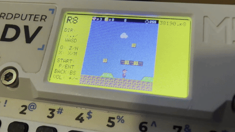

# RONTO8 for M5Cardputer (v0.53)



RONTO8 is an experimental PICO-8 compatible fantasy console emulator specially designed and optimized for the **M5Stack Cardputer**. It is based on [femto8](https://github.com/benbaker76/femto8) and [zepto8](https://github.com/samhocevar/zepto8), bringing the joy of portable PICO-8 gaming and coding to this compact, ESP32-S3-powered device.

RONTO8は、**M5Stack Cardputer** 専用に設計および最適化された PICO-8 互換のファンタジーコンソールエミュレータ（実験バージョン）です。[femto8](https://github.com/benbaker76/femto8) と [zepto8](https://github.com/samhocevar/zepto8) をベースにしており、ESP32-S3を搭載したこのコンパクトなデバイスで、PICO-8のゲームやコーディングの楽しさを持ち歩くことができます。

---

## ⚠️ Disclaimer / 注意事項

- **Experimental Release / 実験的なリリース**: This is highly experimental code. If you find bugs, please report them gently! (実験的なコードであるため、バグを見つけた場合は優しく教えてください！)
- **Memory Limitations / メモリ制限**: Due to the hardware limitations of the M5Cardputer (ESP32-S3), some very large PICO-8 cartridges may not work or may cause "not enough memory" errors during Lua compilation. (Cardputerのハードウェア制限により、非常に大きいカートリッジは動作しないか、コンパイル時にメモリ不足エラーになる場合があります。)

---

## 🌟 Key Features / 主な機能

- **Optimized for M5Cardputer**: Full support for the Cardputer's display, keyboard, and speaker.
  - Cardputerのディスプレイ、キーボード、スピーカーに完全対応。
- **SD Card ROM Browser**: Load `.p8.png` or `.p8` cartridges directly from the SD card.
  - SDカードから `.p8.png` や `.p8` 形式のカートリッジを直接ロード可能。
- **Audio Support**: Enhanced audio synthesis for authentic PICO-8 SFX and Music playback.
  - PICO-8特有の効果音（SFX）やBGMを再現するオーディオエンジンを搭載。
- **Game Patch System**: Apply `.p8t` patch files at startup to make larger cartridges run on RONTO8.
  - 起動時に `.p8t` パッチファイルを適用し、大きめのカートリッジをROMとして動作させるゲームパッチ機能。

## 📝 Changelog / 更新履歴

### v0.53
- **SMB ROM Support**: Added support for Super Mario Bros (Clone). Implemented massive memory optimizations including SD streaming compilation and direct VRAM rendering patches to ensure stability. (SMBロムに対応。SDストリーミングコンパイルとVRAM直接描画パッチの実装により、メモリ制限を突破し動作の安定性を劇的に向上。)

### v0.52
- **Volume Control**: Added volume control functionality using `+` and `-` keys. (ボリューム機能の追加)
- **Error Handling**: Added visual error handling and a red screen halt when Lua errors occur. (エラー処理追加)

### v0.5
- **High-speed Emulation**: Tuned Lua compiler and garbage collector to overcome memory limitations of embedded systems. (組み込み環境のメモリ制限を克服するため、Luaコンパイラとガベージコレクションを徹底的にチューニング。)
- **Color Palette Fix**: Corrected PICO-8 color palette for accurate color reproduction. (PICO-8カラーパレットの色再現精度を修正。)

## 🎮 Controls / 操作方法

- **D-Pad / 方向キー**: `W`, `A`, `S`, `D`
- **Button O (Z/C)**: `Z` or `N`
- **Button X (X/V)**: `X` or `M`
- **Start / Pause**: `Enter`
- **Pause (Alt)**: `P`

**In the ROM Browser / ROMブラウザでの操作**:
- **Up**: `W` or `;`
- **Down**: `S` or `.`
- **Select / Open Folder**: `Enter`

## ⚙️ Installation / インストール

### Via M5Burner (Recommended)
You can easily install RONTO8 using M5Burner with the following share code:
- **Share Code**: `7YPwG8kVxNWh5mFg`

M5Burnerのシェアコード検索から簡単にインストールできます：
- **シェアコード**: `7YPwG8kVxNWh5mFg`

### Building from Source / ソースからビルドする場合

1. Clone the repository:
   ```bash
   git clone https://github.com/Layer812/R8CP.git
   cd R8CP
   ```
2. Build and upload using PlatformIO:
   ```bash
   pio run --target upload ; pio device monitor
   ```
3. Prepare the SD Card:
   Place your `.p8.png` or `.p8` files on the root or in a folder on your MicroSD card and insert it into the Cardputer.
   - MicroSDカードのルートやフォルダ内に `.p8.png` または `.p8` ファイルを置き、Cardputerに挿入してください。
4. (Optional) Game Patches:
   Patch files (`.p8t`) for supported games are included in the [`carts/`](carts/) folder of this repository. Place the `.p8t` file with the **same filename** as the ROM in the same folder on your SD card. The patch will be applied automatically at startup.
   - 対応ゲームのパッチファイル（`.p8t`）はこのリポジトリの [`carts/`](carts/) フォルダに収録されています。SDカード上でROMと**同じフォルダ・同じファイル名**で `.p8t` ファイルを置くと、起動時に自動的に適用されます。

## 🩹 Game Patch Compatibility / ゲームパッチ対応リスト

The following games require a `.p8t` patch to run on RONTO8 due to their cartridge size.  
Patch files are available in the [`carts/`](carts/) folder of this repository.  
**Note: These patches modify the game's internal processing to save memory and ensure compatibility with the Cardputer. As a result, the behavior and visuals may differ slightly from the original unpatched version.**

以下のゲームはカートリッジサイズの関係でROMの書き替えが必要なため、`.p8t` パッチが必要です。  
パッチファイルはリポジトリの [`carts/`](carts/) フォルダに収録されています。  
**注意：これらのパッチはCardputerでの動作と省メモリ化を実現するために、ゲーム内部の処理を変更しています。そのため、オリジナル版とは動作や見た目が一部異なる場合があります。**

| Game / ゲーム | Author | PICO-8 BBS | Patch File |
|---|---|---|---|
| Desert Drift | [johanp](https://www.lexaloffle.com/bbs/?uid=15227) | [#31685](https://www.lexaloffle.com/bbs/?tid=31685) | [`Desert Drift.p8t`](carts/Desert%20Drift.p8t) |
| 東方運命の星 (Touhou Unmei no Hoshi) | [Nallebeorn](https://www.lexaloffle.com/bbs/?uid=33240) | [#36992](https://www.lexaloffle.com/bbs/?tid=36992) | [`unh-3.p8t`](carts/unh-3.p8t) |
| We Missed You! (LD33 compo) | Rhys | [#2322](https://www.lexaloffle.com/bbs/?tid=2322) | [`13021.p8t`](carts/13021.p8t) |
| underworld siege (LD33) | benjamin_soule | [#2319](https://www.lexaloffle.com/bbs/?tid=2319) | [`13025.p8t`](carts/13025.p8t) |
| Celeste | noel | [#2145](https://www.lexaloffle.com/bbs/?tid=2145) | [`15133.p8t`](carts/15133.p8t) |
| The Wee Dungeon 1.2.3 | Parlor | [#3072](https://www.lexaloffle.com/bbs/?tid=3072) | [`19532.p8t`](carts/19532.p8t) |
| Mistigri | benjamin_soule | [#3421](https://www.lexaloffle.com/bbs/?tid=3421) | [`21603.p8t`](carts/21603.p8t) |
| The Slow and the Curious | emu | [#3597](https://www.lexaloffle.com/bbs/?tid=3597) | [`23035.p8t`](carts/23035.p8t) |
| P.Craft | NuSan | [#3200](https://www.lexaloffle.com/bbs/?tid=3200) | [`24981.p8t`](carts/24981.p8t) |
| Wizardish - A First-Person Grid-Based Dungeon Crawler! v2.1 tiny update | Eduardolicious | [#3585](https://www.lexaloffle.com/bbs/?tid=3585) | [`27415.p8t`](carts/27415.p8t) |
| Pico Fox | electricgryphon | [#28067](https://www.lexaloffle.com/bbs/?tid=28067) | [`32479.p8t`](carts/32479.p8t) |
| Super Mario Bros (Clone) | Sascha217 | [#38190](https://www.lexaloffle.com/bbs/?tid=28942) | [`38190.p8t`](carts/38190.p8t)|

> More patches coming soon! / 今後も対応ゲームを追加予定です。

---

## 🙏 Credits and Acknowledgments / 謝辞

RONTO8 is heavily based on the incredible work of the open-source community:
- [benbaker76](https://github.com/benbaker76) - Original author and maintainer of [femto8](https://github.com/benbaker76/femto8)
- [Jacopo Santoni](https://github.com/Jakz) - Author of [retro8](https://github.com/Jakz/retro8)
- [Lexaloffle](https://www.lexaloffle.com/) - The visionary creator of the amazing PICO-8 fantasy console.
- **Layer8** - M5Cardputer Port, Audio engine fixes, and memory optimization.

*(C) 2026 Layer8. BASED ON FEMTO8 & ZEPTO8.*
